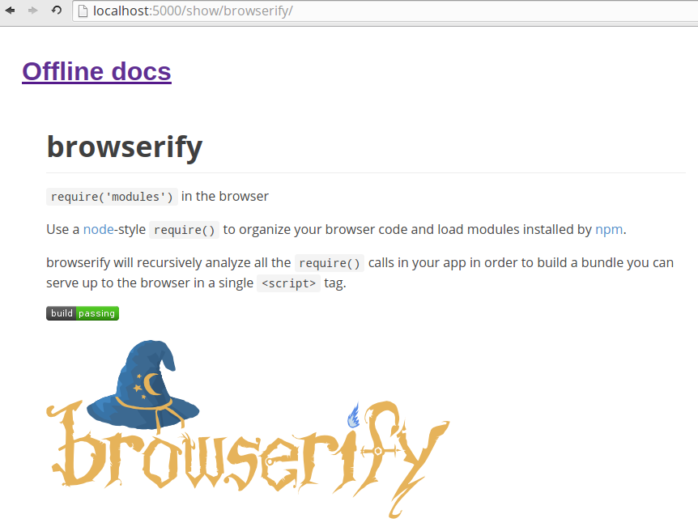

# offline-docs [](https://david-dm.org/vvo/offline-docs) [](https://david-dm.org/vvo/offline-docs#info=devDependencies)



Always get some documentation on the modules you use, even offline.

No network no work? WRONG! Get the minimum documentation when you need it.

```shell
npm install -g offline-docs
cd awesomeNodeJSProject
offline-docs
# Offline docs server listening on http://0.0.0.0:5000
```

Now go to http://0.0.0.0:5000 to see offline docs.

This module may also be usefull in situations where you do have network. It shows all you module dependencies and documentation on a simple page.

## contribute

```shell
git clone git@github.com:vvo/offline-docs.git
cd offline-docs
npm run dev
```

Now go to http://localhost:3000, edit the files, it reloads automatically and PR!
